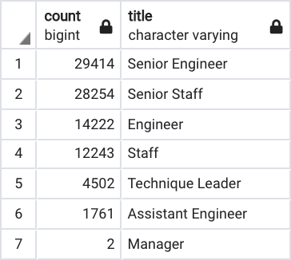
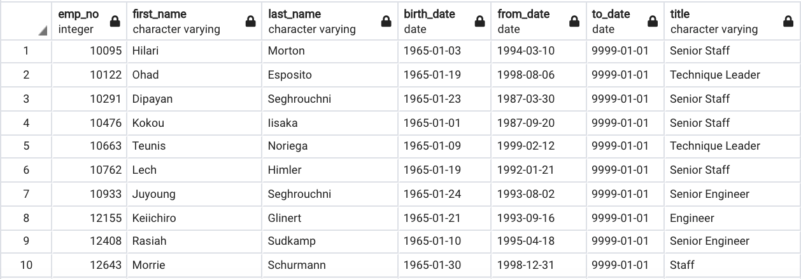

# Pewlett-Hackard-Analysis
## Overview of the analysis: 

In this project we are working with our coworker, Bobby, a fellow HR analyst, to prepare for the large number of upcoming retiring candidates at Pewlett-Hackard. Our job is to use SQL to compile a list of candidates that will be retiring in the near future, the positions that will be left vacant by title, and the number of eligible employees to participate in the mentorship program designed to mentor lowerlevel employees to take up senior positions. This analysis will help Pewlett-Hackard prepare for the “silver tsunami” as many current employees reach retirement age.

## Results: 

* The table below shows a list that holds all the titles of current employees who are up for retirement. 

* A large portion of retirees are senior positions – specifically Senior Staff and Senior Engineer positions that make up more that 63% of the retiring employees. 

* This list below contains 49,9495 eligible employees for the mentorship program to help fill the coming vacant positions. 

* Although if you take a closer look, you see that many of these employees already have Senior titles. 

## Summary:

After reviewing the data, there will need to be over 90,000 roles that will need to be filled as the "silver tsunami" begins to make an impact. There may not be exactly enough people in the company to replace each senior position leaving, but with the mentorship program along with the addition of new hires they will be able to push Pewlett-Hackard forward. 
